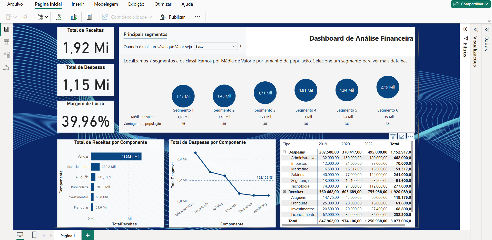

#  Análise Financeira – Receita, Despesas e Lucro

Este dashboard financeiro permite o acompanhamento de receitas, despesas e margens de lucro por componentes e segmentos. Ideal para análise estratégica e controle de custos.

## 🔧 Ferramentas utilizadas
- Power BI
- DAX

## 📊 Principais Indicadores
- KPIs: Receita total, Despesa total, Margem de lucro (%)
- Gráfico de linha por categoria de despesa
- Tabela dinâmica com dados por ano e segmento

## ▶️ Como visualizar
Abra o arquivo `.pbix` .

## 🖼 Captura de Tela

